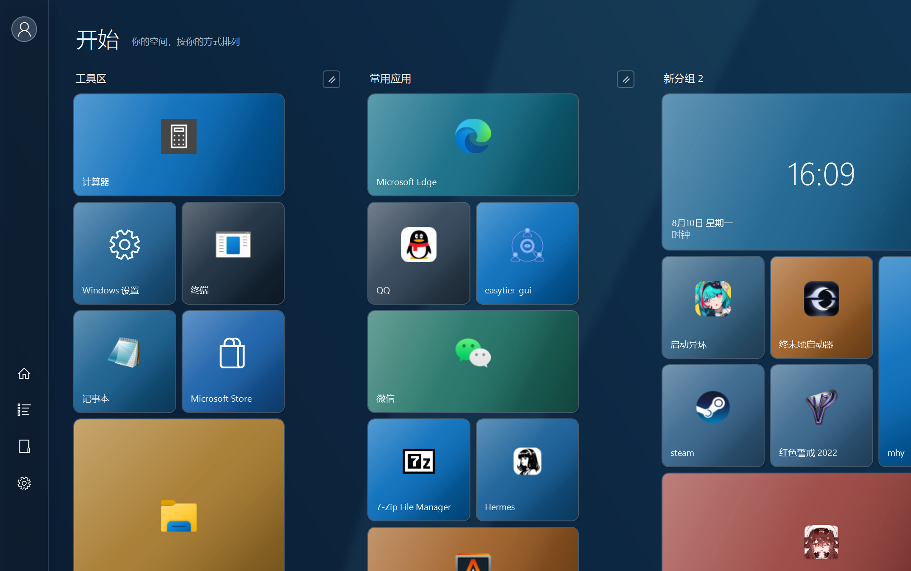
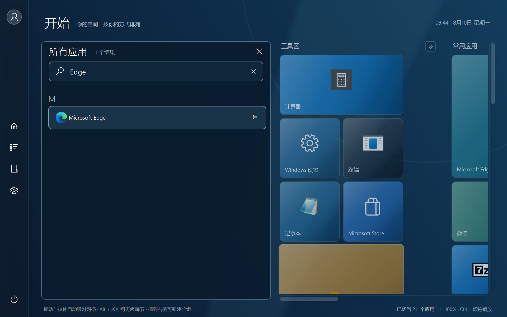
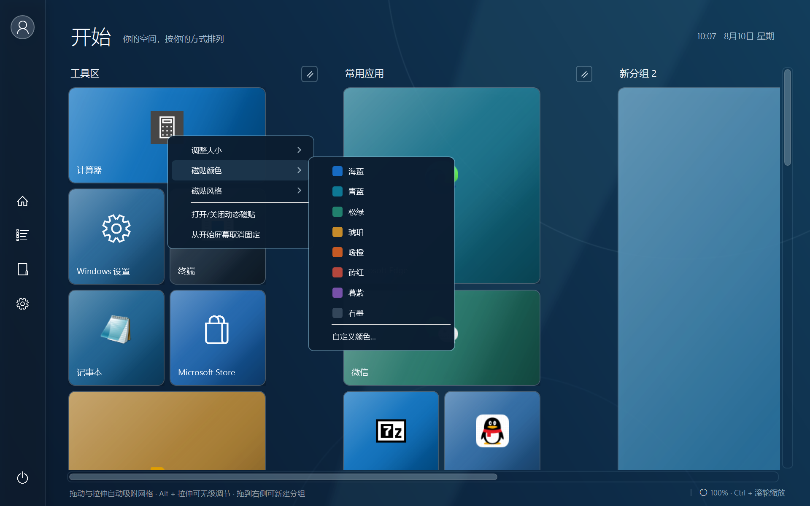

# Tile10

> 在 Windows 11 上重新拥有 Windows 10 风格的全屏开始屏幕。

[](https://www.microsoft.com/windows/windows-11)
[](https://dotnet.microsoft.com/download/dotnet/8.0)
[](https://github.com/sohardcement/StartCanvas/releases/latest)

Tile10 是一个面向 Windows 11 的全屏磁贴启动器。它覆盖鼠标所在显示器的工作区并保留任务栏，不修改 Explorer、不替换系统文件；退出后，Windows 键会立即恢复原本的行为。

[下载最新版](https://github.com/sohardcement/StartCanvas/releases/latest) · [操作速查](#操作速查) · [开发构建](#开发构建)



## 效果预览

| 所有应用与即时搜索 | 磁贴颜色与视觉风格 |
| --- | --- |
|  |  |

## 功能亮点

- **熟悉的开始体验**：单按 Windows 键显示或隐藏，保留任务栏及系统组合键。
- **自由磁贴画布**：拖动、跨组排列、留出空位，并支持小、中、宽、大及自由尺寸。
- **快速找到应用**：自动发现 Win32 快捷方式和 `shell:AppsFolder` 应用，支持即时筛选与键盘启动。
- **个性化外观**：内置深海、青岚、松林、暮紫、暖暮、石墨六套主题；支持自定义图片或纯色背景与可读性遮罩，每块磁贴也可单独设色。
- **动态内容**：内置时钟动态磁贴，并保留可扩展的动态内容模型。
- **自动保存**：分组、位置、尺寸、画布缩放及外观会保存到本地。
- **细腻反馈**：拖放吸附、布局回流、启动动画、空状态和可撤销的取消固定。
- **键盘与辅助功能**：可见焦点、读屏标签、方向键调整分组，并尊重 Windows 动画偏好。

## 下载与使用

1. 从 [Releases](https://github.com/sohardcement/StartCanvas/releases/latest) 下载 `Tile10-win-x64.zip`。
2. 解压到任意文件夹，运行 `Tile10.exe`；无需安装。
3. 单独按一下 Windows 键显示或隐藏磁贴页。
4. 第一次运行会扫描开始菜单和 `shell:AppsFolder`，并生成初始磁贴。

布局保存在 `%LOCALAPPDATA%\Tile10\layout.json`，全局外观保存在同目录的 `appearance.json`。电源菜单中可以开启“开机自动运行”，也可以安全退出 Tile10。

## 操作速查

| 操作 | 结果 |
| --- | --- |
| `Win` | 显示或隐藏 Tile10 |
| `Esc` | 清除当前搜索、返回磁贴页或关闭 Tile10 |
| `Ctrl + F` | 打开所有应用并聚焦搜索框 |
| `Enter` | 启动当前选中的应用或磁贴 |
| `Ctrl + 鼠标滚轮` | 缩放磁贴画布 |
| 拖动磁贴 | 在组内重排、跨组移动或在右侧创建新组 |
| 拖动磁贴右下角 | 按网格调整尺寸；按住 `Alt` 可自由调整 |
| 分组手柄方向键 | 左右调整列数，上下调整行数 |
| `Ctrl + Z` | 撤销最近一次取消固定（编辑文字时保留系统撤销） |

## 已实现的布局能力

- 每个分组默认使用 4 列磁贴网格，可调整为 2–12 列、4–32 行。
- 可把磁贴放到分组内任意空白行列，扩展后的新位置也能直接接收磁贴。
- 可把磁贴拖到现有分组右侧空白区域，自动建立并定位新分组。
- 自由尺寸磁贴范围为 72 × 72 至 952 × 2552；需要时会自动扩展分组。
- 旧版布局中的磁贴文件夹会无损展开为普通磁贴。
- 单击分组名称即可改名；重名、保存失败等状态会给出明确反馈。

## 开发构建

需要 .NET 8 SDK 或更高版本：

```powershell
dotnet build WinTileLauncher.slnx -c Release
```

运行内置回归验证（键盘钩子、应用发现、抽屉、布局、拖放、缩放与视觉转换）：

```powershell
dotnet run --project WinTileLauncher.Verifier/WinTileLauncher.Verifier.csproj -c Release
```

生成免安装、包含运行时的 Windows x64 单文件版本：

```powershell
dotnet publish WinTileLauncher/WinTileLauncher.csproj -c Release -r win-x64 --self-contained true -o dist/Tile10-win-x64 -p:PublishSingleFile=true -p:EnableCompressionInSingleFile=true -p:IncludeNativeLibrariesForSelfExtract=true
```

## 说明

- 当前发布包面向 Windows 11 x64。
- Tile10 必须在后台运行，才能接管单独按下 Windows 键的动作。
- `Win + D`、`Win + E` 等系统组合键仍会按原方式转交给 Windows。
- Windows 11 已移除 Windows 10 的系统 Live Tile 宿主，因此普通第三方应用不会自动恢复旧版动态内容；当前内置时钟动态磁贴。
- 某些管理员权限全屏程序或 Windows 安全桌面可能显示在 Tile10 之上，这是 Windows 的权限边界。
